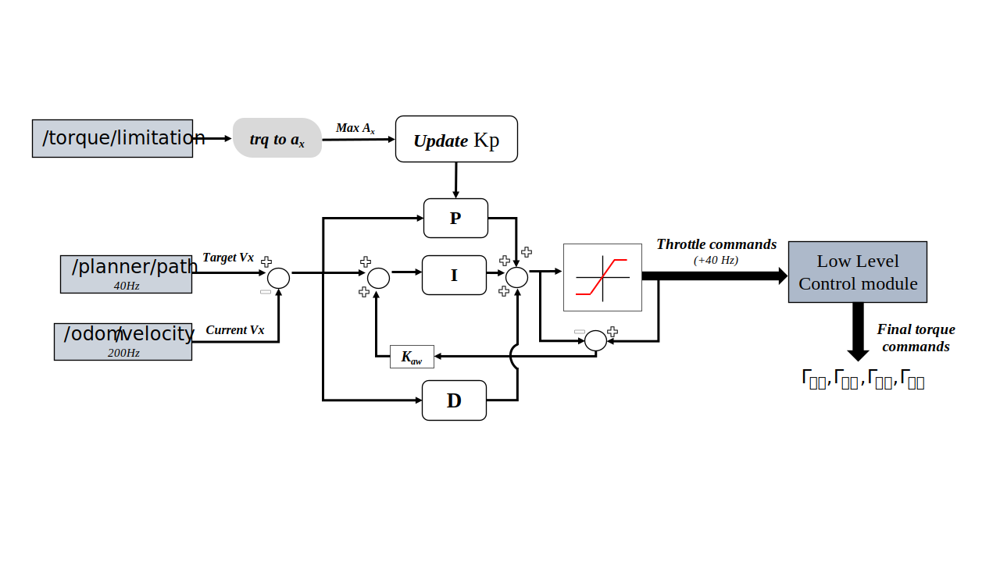

# Adaptive Cruise Controller

    
Table of Contents

    <ol>
        <li>
        <a href="#disclaimer">Disclaimer</a>
        </li>
        <li><a href="#dependencies">Dependencies</a>
        </li>
        <li>
        <a href="#approach">Approach</a>
        </li>
        <li>
        <a href="#workflow">Workflow</a>
        </li>
    </ol>

Here you can find the longitudinal Autonomous Systems controller for CAT15x, the [BCN eMotorsport](https://bcnemotorsport.upc.edu) 2022-23 car.

If you want to see the performance of this controller watch [THIS TRACKDRIVE](https://youtu.be/mk9U0lRWr-0?si=S0-yVm7wfKk2jvPq).

This software is shared as part of my [Final Degree Thesis](docs/tfg_oriolmartinez.pdf).

## Disclaimer
This is a tailored control solution made for the CAT15x Formula Student vehicle. If you plan to use this control algorithm in a Formula Student competition the **only** thing I ask for is to **ALWAYS REFERENCE** the team ___BCN eMotorsport___.

## Dependencies
* [Ubuntu](https://ubuntu.com/) 20.04
* [ROS](https://www.ros.org/) Noetic
* [Eigen3](https://eigen.tuxfamily.org)
* ___as_msgs___: self-defined ROS msgs pkg. 
* ___ctrl_msgs___: self-defined ROS msgs pkg.  

The self-defined msg pkgs are not shared with this repo as they are property of the team. With direct inspection you may change these msgs for yours adapting the [necessary callbacks](include/longitudinal.hh).

## Approach

For specific information on how this longitudinal controller works read [Cruise Controller](docs/tfg_oriolmartinez.pdf)'s paper.

## Workflow
The controller's arechitecture is as follows:

<!-- <h3 align="center">Tailored MPC</h3> -->

 

__NOTE:__ _In order to ease the real testing tuning procedure, the antiwindup strategy is limited into not updating the integral term in case of control outuput saturation. Thus, the Kaw gain seen in this diagram is not part of the [PID class](include/pid.hh)_.
